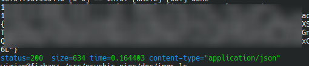

## Useful Curl Queries

### Logging in

```
curl -k -vvv -X POST https://localhost:8080/users/login   -H "Content-Type: application/json"   -d '{"username":"'${ADMIN_USER}'","password":"'${ADMIN_USER_PASSWORD}'"}'
```

Note the quoting. Since variables wont expand inside single quotes we start a single quote part end it add our paramenter start the next single quote part etc.

The -k is for ignoring the ssl (self signed) certificate, otherwise curl will complain about it and fail.
The -vvv is for debugging and will be very verbose. The more v's the more verbose. It is very useful for seeing the ssl handshake.

### Logging in and getting a token
Taking it a step further:

```aiignore
TOKEN=$(curl  -k -s -X POST https://localhost:8080/users/login   -H "Content-Type: application/json"  \
 -d '{"username":"'${ADMIN_USER}'","password":"'${ADMIN_USER_PASSWORD}'"}'   |  grep -o '"token":"[^"]*"' | cut -d'"' -f4 )
```

or if you got jq installed:

```aiignore
TOKEN=$(curl  -k -s -X POST https://localhost:8080/users/login   -H "Content-Type: application/json" \
 -d '{"username":"'${ADMIN_USER}'","password":"'${ADMIN_USER_PASSWORD}'"}'   |  head -1 | jq -r .token )

```
Note the use of head -1. This is because I use the status line for curl as outlined below. We are only interested in the first line.
If you don't have the status line set it wont hurt as you still get the token on the first line.

This will get the token and store it in the TOKEN variable.

```aiignore
    echo $TOKEN
```

### Using the token
Now we can use it in our curl commands:

```aiignore
curl -k -X GET http://localhost:8080/pies \
  -H "Authorization: Bearer $TOKEN"
```


## Making your curl output a little more informative
Have a look at https://github.com/samuelcolvin/init-desktop
It has a nice little script that will generate a .curlrc file for you. That will look like this:



With this you will get a nice status line for each curl command. Showing you the status code, the time it took to execute and the size of the response.
Download the script [make_curlrc.py](https://github.com/samuelcolvin/init-desktop/blob/master/make_curlrc.py) make it executable and run it. You need python3 installed.
On linux the .curlrc should be in your home directory. On windows it should be in your user directory. (Windows: %USERPROFILE%\\.curlrc)